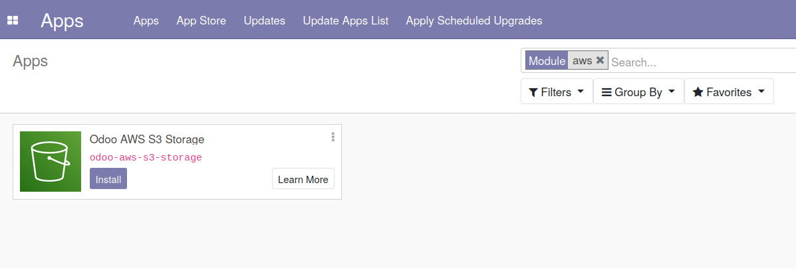
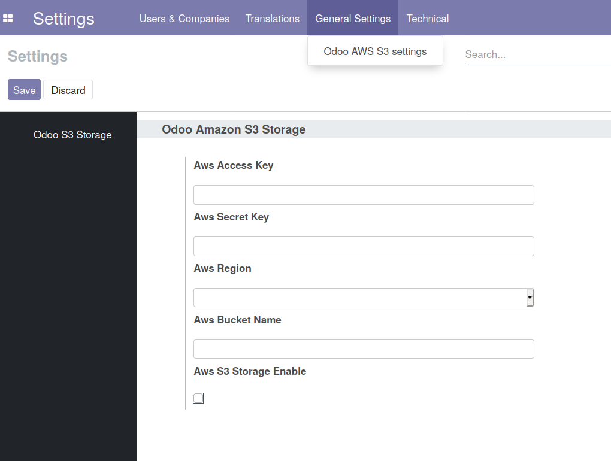
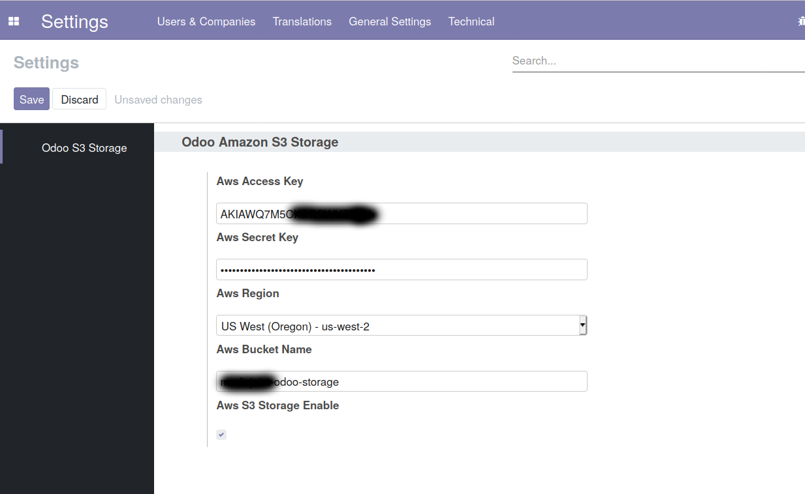

# Odoo AWS S3 Storage

## Summary

Allows to use Amazon S3 Bucket as file storage

## Description

Binary files such as attachments and pictures are stored by default in the file system of the host running Odoo. In some cases you may want to decrease the overall response time by delegating static file        storage to a specialized instance such as an AWS S3 bucket. This module allows you to configure Odoo so that an AWS S3 bucket is used instead of the file system for binary files storage.

## Dependencies
`Odoo-S3-Storage` uses [`boto3`](https://github.com/boto/boto3) to talk to AWS S3. You will need to install it on the host running Odoo.

## Installation
Make sure you set the `ODOO_ADDONS_PATH` variable to the directory where you install your custom Odoo modules.

```bash
pip install boto3
cd $ODOO_ADDONS_PATH
git clone https://github.com/gabrielmartinez/odoo-aws-s3-storage.git
```

## Compatibility
This module is compatible with **Odoo 13** and **Python 3**. For older versions, you can refer to the original source code (see credits below).

## Configuration
In order to use `odoo-aws-s3-storage` you will need install on Apps:




Then, go to Settings -> General Settings -> Odoo AWS S3 Settings




And Fill with custom values:




This module is based on `https://github.com/HP-bkeys/odoo-s3-storage`

